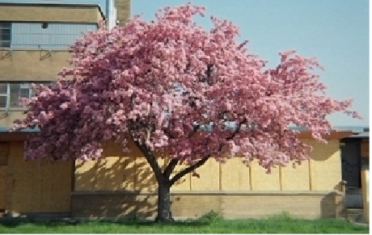
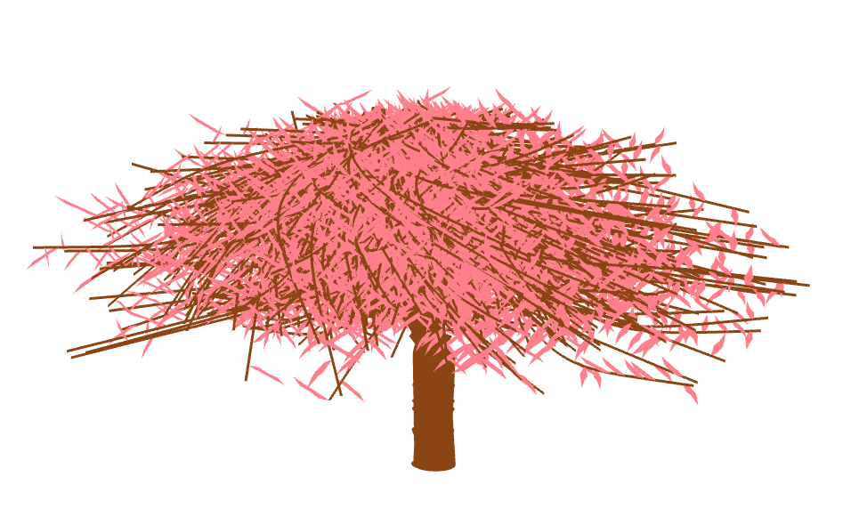
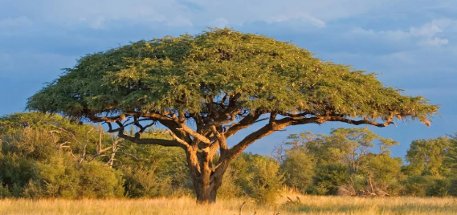
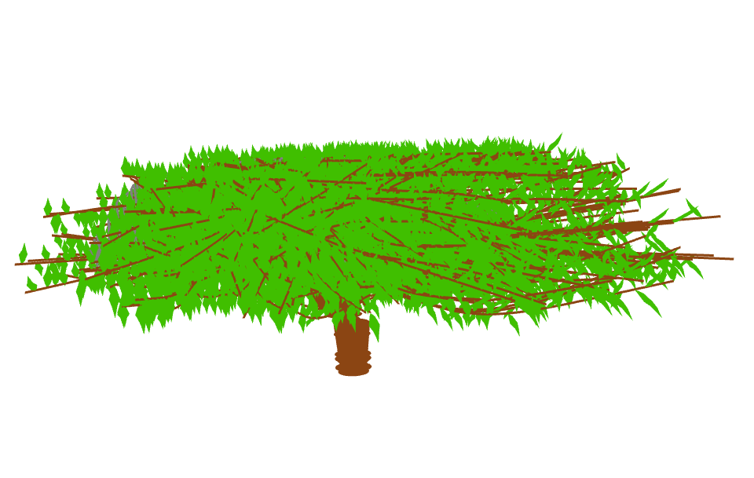
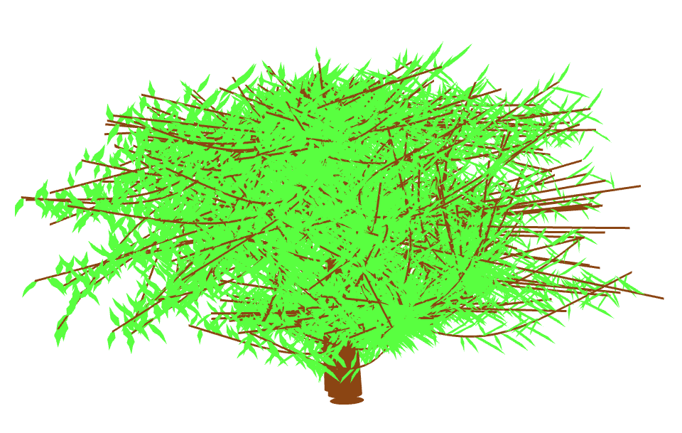

# Single Image Tree Modelling

An application that accepts an image of a tree (only `.jpg`) along with two descriptive strokes, one for the crown and another for the trunk. Using this information, it builds a 3D model for the tree.

This project attempts to illustrate a simple sketching technique called Single Image Tree Modelling. The methodology radiates around taking one single image as a source and extracting a true-to-life 3D model of the tree. This technique helps us automate the generation of branches through synthesis from a growth engine that might include a pre-defined library of elementary sub-trees or via retention of the visible units. We plan to develop characteristics such as the colour and height of the tree and work towards similar design patterns and features involved in recognition. The end goal is to generate images with attention to detail in components, grained to the microscopic level.

## How to run?

```shell
mkdir build
cd build
cmake ..
make
cd ..
./Project <tree-image>.jpg
```

## Examples

Input              | Output
:-----------------:|:-----------------------:
  |  
  |  
  |  
